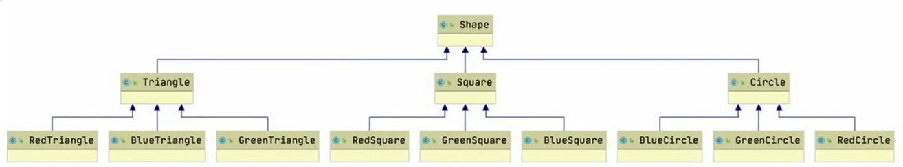
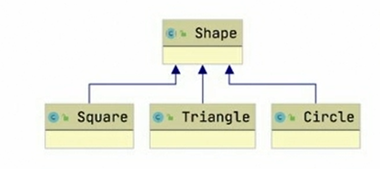

# Bridge

## Description

The bridge design pattern helps manage complex inheritance hirerarchies. For example, let's imagine that we would like to model shapes with differents colors. Without the bridge design pattern, you may model theme as follow.



With the bridge design pattern we could simplify this by separating the interfaces by features. A hirerachy for the shape and a hirerachy for the color. Then, we can let one of hirerarchies rely on the other through the constructor.




So, here the the shape hirerachy would expect an argument that conforms to the ColorShape interface.

## Sample Example

```kotlin
package structural.classes.bridge.pattern

import java.awt.Graphics

abstract class Shape {
    abstract fun draw(graphics: Graphics?)
}
```

```kotlin
package structural.classes.bridge.pattern.type

import structural.classes.bridge.pattern.Shape
import structural.classes.bridge.pattern.colored.ColorShape
import java.awt.Graphics

class Circle(private var colorShape: ColorShape) : Shape() {
    override fun draw(graphics: Graphics?) {
        colorShape.setColor(graphics!!)
        graphics.fillRect(75, 15, 50, 50)
    }
}
```

```kotlin
package structural.classes.bridge.pattern.colored

import java.awt.Graphics

interface ColorShape {
    fun setColor(graphics: Graphics): Unit;
}
```

```kotlin
package structural.classes.bridge.pattern.colored

import java.awt.Color
import java.awt.Graphics

class RedColorShape : ColorShape {
    override fun setColor(graphics: Graphics) {
        graphics.color = Color.RED
    }
}
```

```kotlin
package structural.classes.bridge

import structural.classes.bridge.pattern.colored.RedColorShape
import structural.classes.bridge.pattern.type.Circle
import java.awt.Dimension
import java.awt.Graphics
import javax.swing.JFrame
import javax.swing.JPanel

class Canvas : JPanel() {
    override fun paint(graphics: Graphics?) {
        val circle = Circle(RedColorShape())
        circle.draw(graphics)
    }
}

fun main() {
    val frame = JFrame()
    frame.size = Dimension(400, 400)
    frame.add(Canvas())
    frame.defaultCloseOperation = JFrame.EXIT_ON_CLOSE
    frame.isVisible = true
}
```
